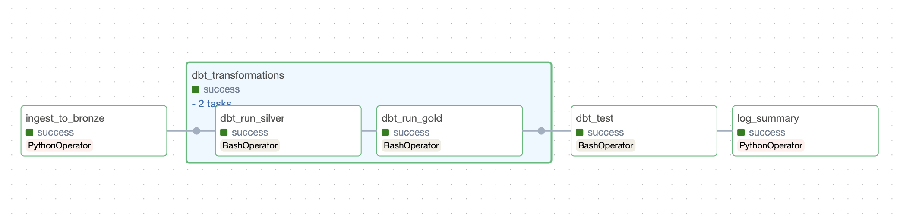
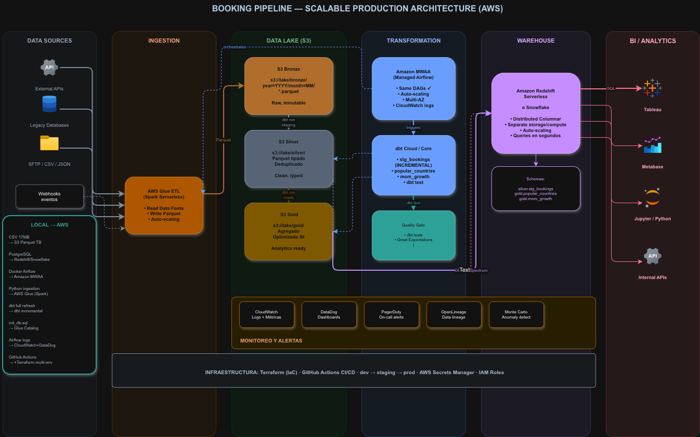
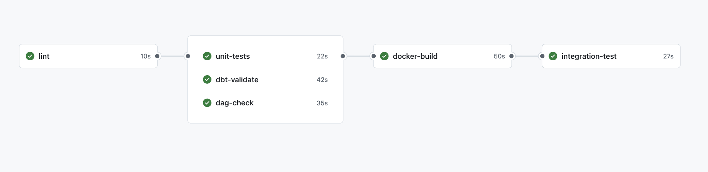
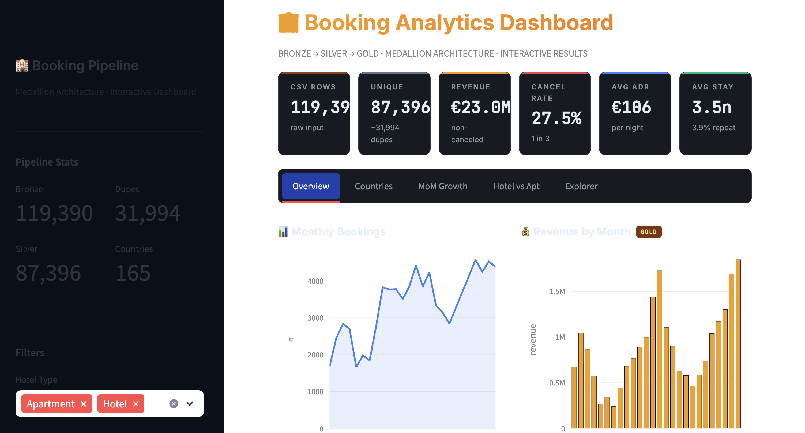

# Booking Analytics Pipeline

End-to-end data pipeline that transforms raw hotel booking data into actionable analytics using the **Medallion Architecture** (Bronze → Silver → Gold), orchestrated with **Apache Airflow**, transformed with **dbt**, and containerized with **Docker**.



## Key Findings

| Metric | Value |
|--------|-------|
| Total CSV rows | 119,390 |
| Unique rows (after dedup) | 87,396 |
| Duplicates removed | 31,994 (SHA-256) |
| Cancellation rate | 37% (Hotel: 41.7%, Apartment: 27.8%) |
| Total revenue (non-canceled) | €26M |
| Average daily rate | €101.83 |
| Average stay | 3.4 nights |
| Countries represented | 165 |
| Repeat guest rate | 3.2% |
| Period covered | July 2015 – August 2017 |

---

## Architecture

The pipeline follows the **Medallion Architecture** pattern from Databricks, separating data into three layers with clear responsibilities:

```
┌─────────┐     ┌─────────────┐     ┌─────────────┐     ┌─────────────┐
│  CSV    │────▶│   BRONZE    │────▶│   SILVER    │────▶│    GOLD     │
│  File   │     │  Raw/TEXT   │     │ Clean/Typed │     │  Analytics  │
└─────────┘     └─────────────┘     └─────────────┘     └─────────────┘
  119,390         87,396 rows        87,396 rows        2 analytical
   rows          (deduplicated)      (transformed)        models
```

### Infrastructure Components

| Component | Technology | Purpose |
|-----------|------------|---------|
| Orchestration | Apache Airflow 2.8 | DAG scheduling, retries, monitoring |
| Transformation | dbt-postgres 1.7/1.8 | SQL-based Silver and Gold models |
| Database | PostgreSQL 15 | Data warehouse (Bronze, Silver, Gold schemas) |
| Ingestion | Python 3.11 + psycopg2 | CSV parsing, hashing, batch loading |
| Containerization | Docker Compose | 4 services: postgres, airflow-init, webserver, scheduler |
| CI/CD | GitHub Actions | 6-stage automated pipeline |
| Testing | pytest + dbt tests | 28+ data quality and unit tests |

### Services Architecture

The `docker-compose.yml` defines 4 services:

- **booking-postgres**: PostgreSQL 15 with two databases — one for booking data (Bronze/Silver/Gold schemas), one for Airflow metadata.
- **airflow-init**: One-time initialization service that creates the Airflow admin user.
- **airflow-webserver**: Web UI accessible at `http://localhost:8080` (user: airflow, pass: airflow).
- **airflow-scheduler**: Monitors and triggers DAG runs on schedule.

### Pipeline DAG

The Airflow DAG `booking_medallion_pipeline` executes 5 tasks in sequence:

```
ingest_to_bronze → [dbt_run_silver → dbt_run_gold] → dbt_test → log_summary
```

- **ingest_to_bronze**: Python task that reads CSV, computes SHA-256 hashes, and loads into Bronze with ON CONFLICT deduplication.
- **dbt_run_silver**: dbt model that cleans, types, deduplicates, and enriches data.
- **dbt_run_gold**: dbt models that create analytical tables (popular_countries, mom_growth).
- **dbt_test**: Quality gate — runs all dbt tests. If any fail, the pipeline stops.
- **log_summary**: Logs ingestion metrics pulled from XCom.

---

## Assumptions

1. **CSV as S3 proxy:** The local CSV simulates a daily extract from S3. In production, the ingestion script would read from S3 using boto3.
2. **Exact duplicates are errors:** Rows with identical values across all 32 columns (31,994 found) are treated as ingestion duplicates, not intentional records. This would be validated with the business team in production.
3. **Canceled bookings generate zero revenue:** A canceled reservation did not materialize, so `revenue = 0` regardless of ADR. Cancellation data is preserved in Silver for behavioral analysis.
4. **Zero-night stays are valid edge cases:** 715 bookings with 0 nights (revenue = €0) are kept in Silver. They may represent day-use rooms or data entry errors.
5. **Country codes may be anonymized:** Codes like SOM, TON, GMB likely represent anonymized European countries in the original dataset (ISO 3166-1 alpha-3).
6. **NULL and NA strings represent missing data:** Both literal text strings "NULL" and "NA" in the CSV are converted to real SQL NULLs in Silver using NULLIF chains.
7. **ADR outliers are preserved:** One negative ADR (-€6.38) and 1,959 zero-ADR records are kept as-is. In production, these would be flagged for review with the business team.
8. **Single-run batch processing:** The pipeline is designed for daily batch execution, not real-time streaming. Scaling to streaming would require architectural changes.
9. **total_booking_amount is revenue, not count:** `total_booking_amount` represents total revenue (sum of ADR × nights) rather than booking count, as it provides more business value for MoM growth analysis

---

## Design Decisions

| Decision | Rationale |
|----------|-----------|
| **All TEXT in Bronze** | Tolerates schema drift. If the CSV format changes, Bronze won't break. Type validation happens in Silver where we control error handling. |
| **Double NULLIF pattern** | `NULLIF(NULLIF(col, 'NA'), 'NULL')` — the CSV uses both "NULL" and "NA" as text strings for missing values. A single NULLIF would miss one of them. |
| **SHA-256 for deduplication** | Practically zero collision probability (2^128 vs MD5's 2^64). Concatenates all 32 columns with pipe separator to create a unique fingerprint per row. |
| **Revenue = 0 for canceled** | Canceled bookings didn't generate actual income. Keeping them in Silver (with revenue=0) allows cancellation analysis without inflating financial metrics. |
| **COALESCE for night calculations** | `COALESCE(stays, 0)` prevents NULL propagation. Without it, ADR * NULL = NULL instead of the correct ADR * 0 = 0. |
| **LAG() with PARTITION BY hotel_type** | Ensures each accommodation type has its own independent MoM timeline. Hotel's January doesn't compare against Apartment's December. |
| **ROW_NUMBER() as second dedup layer** | Defense in depth. Even though Bronze uses ON CONFLICT, Silver applies ROW_NUMBER() PARTITION BY _row_hash as a safety net. |
| **Batch inserts of 5,000 rows** | Balance between memory usage and database round trips. Row-by-row = 119K transactions (slow). All-at-once = memory risk. 5,000 = 24 efficient batches. |
| **SAVEPOINT per batch** | If batch #20 fails, only that batch rolls back. The 19 successful batches are preserved. Without savepoints, one failure loses everything. |
| **ON CONFLICT DO NOTHING** | Guarantees idempotency. Re-running the ingestion produces the same result — duplicates are silently ignored instead of causing errors. |
| **materialized='table' in dbt** | Tables are faster for downstream queries and tests validate real data. Views would re-execute the query every time. In production with frequent updates, we'd use incremental. |
| **catchup=False in Airflow** | Prevents hundreds of backfill runs from start_date to today. Only the most recent run executes. Historical backfill uses Airflow's manual backfill command. |
| **max_active_runs=1** | Prevents concurrent pipeline executions that would write to the same tables simultaneously, causing data corruption. |
| **Retry with exponential backoff** | 2 retries with 5min to 10min delays. Handles transient failures (database overload, network issues) without overwhelming the system. |

---

## Scaling Strategy

| Component | Current (Local) | Production |
|-----------|----------------|------------|
| Data Source | CSV file | S3 + Parquet (partitioned by date) |
| Warehouse | PostgreSQL 15 | Snowflake / BigQuery |
| Orchestration | Docker Airflow | MWAA / Cloud Composer |
| dbt Models | Full refresh | Incremental + snapshots |
| Monitoring | Airflow logs | DataDog + PagerDuty + OpenLineage |
| CI/CD | GitHub Actions | k8s + Terraform (IaC) + multi-environment |
| Data Format | CSV (row-based) | Parquet (columnar, compressed) |
| Scheduling | @daily | Event-driven (S3 trigger) |


The Medallion Architecture allows migrating layer by layer without disrupting the existing pipeline. Bronze could move to S3 while Silver and Gold remain in PostgreSQL, then migrate incrementally.

---

## Quick Start

### Prerequisites

- Docker and Docker Compose installed
- Git

### 4 From ZIP file
```bash
# 1. Unzip and enter the project
unzip booking-pipeline-main.zip
cd booking-pipeline-main

# 2. Create environment file
cp .env.example .env

# 3. Start all services (first run takes 2-5 min)
docker compose up -d --build

# 4. Verify all containers are running
docker compose ps

# 4.Verify Results
docker exec -it booking-pipeline-booking-postgres-1 psql -U booking_user -d booking_db
```

### 5 Open Airflow and run the pipeline

1. Open `http://localhost:8080` (user: `airflow`, password: `airflow`)
2. Find the DAG **booking_medallion_pipeline**
3. Toggle the switch to **ON**
4. Click the **play button** to trigger a manual run
5. Wait 2-3 minutes — all 5 tasks should turn **green**

### 6 commands to full deployment using github

```bash
# 1. Clone the repository
git clone # 1. Clone the repository
git clone https://github.com/HelenaGomezV/booking-pipeline.git
cd booking-pipeline

# 2. Create environment file
cp .env.example .env

# 3. Start all services
docker compose up -d --build

# 4. Open Airflow and trigger the DAG
open http://localhost:8080
# Login: airflow / airflow
# Find "booking_medallion_pipeline" -> Toggle ON -> Triggercd booking-pipeline

```

All 5 tasks should complete in green within 2-3 minutes.

### Verify Results

Connect to PostgreSQL and run these queries:

```bash
docker exec -it booking-pipeline-booking-postgres-1 psql -U booking_user -d booking_db
```

```sql
-- Bronze: raw data count
SELECT COUNT(*) FROM bronze.raw_bookings;
-- Expected: 87,396

-- Silver: cleaned data
SELECT COUNT(*), AVG(adr)::NUMERIC(10,2) AS avg_adr
FROM public_silver.stg_bookings;
-- Expected: 87,396 rows, avg_adr ~101.83

-- Gold: top 5 countries
SELECT country, total_bookings, popularity_rank
FROM public_gold.popular_countries
ORDER BY popularity_rank
LIMIT 5;

-- Gold: MoM growth sample
SELECT hotel_type, year_month, total_booking_amount, mom_pct_change
FROM public_gold.mom_growth
WHERE hotel_type = 'Hotel'
ORDER BY year_month
LIMIT 6;
```

---

## Testing Strategy

### Three levels of testing

**1. dbt declarative tests** (in schema.yml files):
- `unique` and `not_null` on key columns
- `accepted_values` for hotel type, is_canceled
- Relationships between models

**2. dbt custom tests**:
- `volume_check.sql`: Fails if Silver has fewer than 80,000 rows
- `test_positive_value` macro: Reusable check for non-negative values

**3. Python unit tests** (pytest):
- `test_ingestion.py` (6 tests): Hash determinism, SHA-256 format, schema validation
- `test_data_quality.py` (7 tests): Volume, accepted values, data distribution

### Run tests

```bash
# Python tests
python -m pytest tests/ -v

# dbt tests (from dbt_project directory)
cd dbt_project && dbt test --profiles-dir .

# Local CI (all checks)
bash scripts/run_ci_local.sh
```

---

## CI/CD Pipeline

GitHub Actions runs a 6-stage pipeline on every push to `main`:

| Stage | What it does | Depends on |
|-------|-------------|------------|
| 1. Lint | flake8 + black format check | -- |
| 2. Unit Tests | pytest (13 tests) | Lint |
| 3. dbt Validate | dbt compile with PostgreSQL | Lint |
| 4. DAG Check | Airflow DAG import validation | Lint |
| 5. Docker Build | Image build test | Tests + Validate + DAG |
| 6. Integration | docker compose up/down | Docker Build |
### Example scalable architecture 



---
## CI pipeline


## Project Structure

```
booking-pipeline/
├── dags/
│   └── booking_pipeline.py          # Airflow DAG (5 tasks)
├── scripts/
│   ├── ingestion.py                 # Bronze: CSV → PostgreSQL
│   ├── init_db.sql                  # Schema creation (bronze, silver, gold)
│   ├── run_dbt.sh                   # dbt wrapper for Airflow
│   └── run_ci_local.sh              # Local CI validation
├── dbt_project/
│   ├── models/
│   │   ├── staging/
│   │   │   ├── stg_bookings.sql     # Silver model
│   │   │   └── schema.yml           # Source + tests
│   │   └── marts/
│   │       ├── popular_countries.sql # Gold: country ranking
│   │       ├── mom_growth.sql        # Gold: MoM revenue
│   │       └── schema.yml           # Gold tests
│   ├── tests/
│   │   └── volume_check.sql         # Custom volume test
│   ├── macros/
│   │   └── test_positive_value.sql  # Reusable test macro
│   ├── dbt_project.yml
│   └── profiles.yml
├── tests/
│   ├── test_ingestion.py            # 6 Python unit tests
│   └── test_data_quality.py         # 7 data quality tests
├── notebooks/
│   └── exploration.py               # Initial data exploration
├── data/raw/
│   └── bookings.csv                 # Source dataset
├── docs/images/
│   └── pipeline_dag.png             # DAG screenshot
├── .github/workflows/
│   └── ci.yml                       # 6-stage CI/CD pipeline
├── Dockerfile
├── docker-compose.yml               # 4 services
├── requirements.txt                 # Docker (Python 3.11)
├── requirements-dev.txt             # Mac dev (Python 3.12)
├── .env.example                     # Environment template
├── .gitignore
└── README.md
```
## Interactive Dashboard

A Streamlit dashboard is included to explore the pipeline results interactively.
```bash
cd dashboard
pip install -r requirements.txt
python3 -m streamlit run app.py
```


Features: KPI cards, country rankings, MoM growth charts, Hotel vs Apartment comparison, and a Silver layer data explorer with sidebar filters.

---

## Author

**Helena Gomez Villegas**
- Email: helena.villegas90@gmail.com
- LinkedIn: [linkedin.com/in/yhgomez](https://linkedin.com/in/yhgomez)
